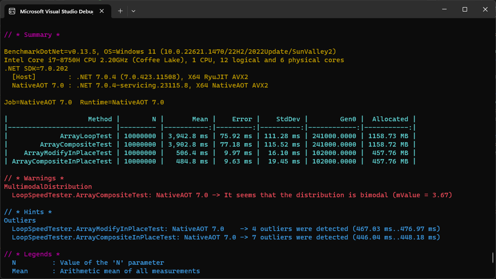
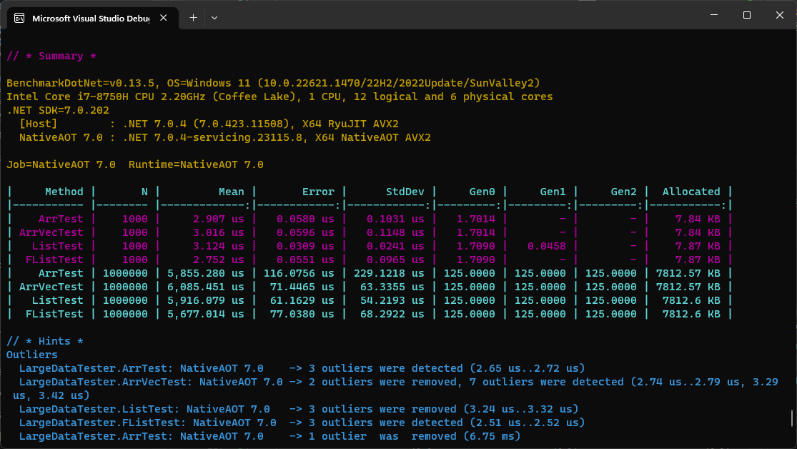

# RanSharp

TomLBZ's Personal C# Library

It is said that a computer builds fantasy out of reality. To achieve this purpose, it must be easy enough to use. 
Sometimes we are just stuck with a lot of boilerplate code, such as looping through lists and arrays to perform 
computation based on each element. This library is designed to make it easier to write code that achieves the same purpose, 
but simpler and faster.

### Important Note
This library is still in development, and is for personal use. It is not recommended to use it in production code, 
because there will likely be breaking changes and new bugs. However, if you are interested in using it,
please feel free to do so. Also feel free to contribute to this project or give it a star (wink:)).

# Usage
```csharp
using RanSharp.Performance;
using RanSharp.Maths;

// Using the ArrVector<T> struct =============================================

// Variable creation --------------------------------
// Create a new ArrVector<int> with 5 elements
ArrVector<int> a = new(1,2,3,4,5); 
ArrVector<int> b = new(5, i => i); // Same effect
// Create a new ArrVector<double> with 1e6 elements, each initialized to the square root of its index
ArrVector<double> c = new(1e6, i => Math.Sqrt(i));
// there are many more ways to create an ArrVector. Use your intellisense:)

// Arithmetics --------------------------------------
var sin_c = c.Map(Math.Sin); // Apply the sine function to each element and store the result in a new ArrVector<double>
Func<double, double, double> f = (a,b) => {/*YOUR_CALCULATIONS*/}; // Create a function that does something
c.CompositeInPlace(sin_c, f); // Mutate c by applying the function to each element of c and sin_c
c.CompositeInPlace(sin_c, (a,b) => {/*YOUR_CALCULATIONS*/}); // Same effect, but using a lambda expression
var d = (c + 1) / 2; // Element-wise arithmetic operators are supported.
var e = c * c; // Dot product. (Cross product is c % c, angle between vectors is c / c)

// Using the Loop class and Loop<T>, NumericLoop<T> classes ===================
int size = 1e6;
Random r = new();
double[] data = new double[size];
data.MapInPlace(i => r.NextDouble()); // fill data with random values
data.CombineInPlace(5d, (a,b) => a + b); // Mutate data by adding 5 to each element
// Wait... since when did double[] have this strange method called CombineInPlace?
// Well... it is placed in RanSharp.Performance.Loop<T> class.
FastList<double> flist = new(size, i=>5d); // Create a FastList<double> with 1e6 elements, each initialized to 5
double[] values = new double[size];
flist.Apply(i => values[i] = i); // Apply can be used to modify other variables!
// There are more useful extension methods in the Loop<T> class. Use your intellisense:)
// Wait... what is a FastList<T>?
// It is a list that is faster than the original List<T>. Talking about performance...
```

# Performance
The performance of this library is ***faster*** than original C# code!

A Looping comparison when the computation is normal (many instructions per loop):
<br>This library has bigger overhead creating each for loop compared to original C# code,
but the loop speed itself is superior to the original C# code. Therefore, it is best used when
the computation inside the for loop is normal or heavy.


A Looping comparison when the computation is light (only a few instructions per loop):
<br>Since computation is light, ArrVector become slightly slower than an array. However, 
FastList is still faster than the original C# List.
